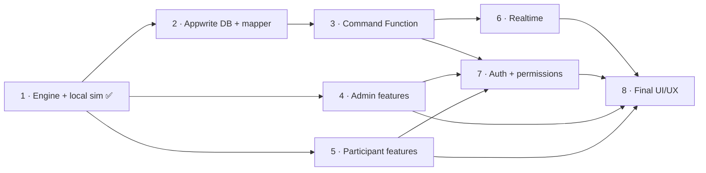

# IPL Auction — Phase-wise Development Plan

This folder is the working plan for the **IPL Auction** feature inside the Anirveda website.
Read this file first, then [00-integration-contract.md](./00-integration-contract.md), then the phase you are working on.

> Source of truth for *requirements*: [`Claude.md`](../Claude.md) (note: that file is currently cut off after section 18).
> Source of truth for *how things work*: the code in `src/lib/iplAuction/` and this folder.

---

## Status

| Phase | Name | Status | Depends on | Can run in parallel with |
|---|---|---|---|---|
| 1 | [Architecture, engine & local simulation](./phase-1-architecture-and-engine.md) | ✅ Done (2026-09-25) | — | — |
| 2 | [Appwrite database & persistence mapping](./phase-2-appwrite-database.md) | ⬜ Not started | 1 | 4, 5 |
| 3 | [Server-authoritative engine (Appwrite Function)](./phase-3-server-authoritative-engine.md) | ⬜ Not started | 2 | 4, 5 |
| 4 | [Admin functionality](./phase-4-admin.md) | ⬜ Not started | 1 | 2, 3, 5 |
| 5 | [Participant functionality](./phase-5-participant.md) | ⬜ Not started | 1 | 2, 3, 4 |
| 6 | [Real-time synchronization](./phase-6-realtime.md) | ⬜ Not started | 3 | — |
| 7 | [Authentication & permissions](./phase-7-auth-permissions.md) | ⬜ Not started | 3 (and 4, 5 for guards) | 6 |
| 8 | [Final UI/UX](./phase-8-ui-ux.md) | ⬜ Not started | 4, 5, 6, 7 stable | — |

Update this table when a phase starts or finishes.

## Dependency graph

**Why this order avoids integration problems**

1. Every feature talks to the auction through **one repository contract** (`getSnapshot / subscribe / dispatch`). Phases 4 and 5 are built and tested against the *local* adapter, and they keep working unchanged when Phase 3 swaps in the *Appwrite* adapter.
2. All business rules live in **one pure engine** (`reduce(state, command)`). The browser and the Appwrite Function run the *same* code, so they can never disagree about what a valid bid is.
3. **Who is acting** (the actor) comes from one hook, `useAuctionActor()` (introduced in Phase 4/5). Phase 7 changes only that hook and the server-side resolver; pages don't change.
4. **The UI is last.** Phase 8 replaces the look of the pages; it doesn't touch rules, data or sync.

## How to work on a phase

1. Read [00-integration-contract.md](./00-integration-contract.md). Anything listed there is frozen: change it only through the process described in that file.
2. Open your phase file. Work only inside the **Files owned** list. If you must touch something else, write it under *Handoff notes* in the phase file.
3. Get the approvals the phase file asks for **before** any Appwrite, `.env`, dependency, deploy or git action.
4. Finish with the phase's **Definition of done** plus the universal one below, then fill in *Handoff notes* and update the status table above.

## Git workflow: one branch per phase (stacked)

- Each phase lives on its own branch: `feat/ipl-auction-phase-1`, `feat/ipl-auction-phase-2`, …
- Branches are **stacked**: phase N+1 branches from phase N, so each PR shows only that phase's changes. Open phase N+1's PR against phase N's branch (or against `main` once phase N is merged).
- Never commit IPL work directly to `main`. Push only when the owner says so.

## Universal definition of done (every phase)

- [ ] `npm run test:ipl` passes, including new tests for every new rule or command.
- [ ] `npm run build` passes.
- [ ] No business rule was added to JSX, hooks or adapters (only to `src/lib/iplAuction/engine/`).
- [ ] No unrelated Anirveda page or MockRBI file changed.
- [ ] No secrets committed; `.env` untouched unless the phase explicitly got approval.
- [ ] Contract changes (if any) recorded in the changelog in `00-integration-contract.md`.
- [ ] *Handoff notes* in the phase file filled in (what was done, what's left, known issues).

## Auction format (decided 2026-09-26)

Players come up **in sequence**. **Bidding happens offline in the room.** When the hammer falls, the admin records the result (winning team + price, or UNSOLD); the engine checks purse/squad/role/overseas rules, the team's purse drops and its dashboard updates. Teams are **view-only**. See the changelog in [00-integration-contract.md](./00-integration-contract.md).

## Known issues and blockers (as of 2026-09-25)

| # | Issue | Impact | Planned fix |
|---|---|---|---|
| K1 | No `.env` exists locally, and `src/config/appwrite.js` throws when `VITE_APPWRITE_ENDPOINT` is missing. `App.jsx` imports MockRBI pages eagerly, so **the whole site renders blank** without env vars. | Can't run the site locally without setting env vars. Workaround: set them on the dev-server process only (see Phase 1 file). | Phase 2 prerequisite (needs approval): make the config tolerate missing env vars. |
| K2 | `.gitignore` covers `.env` but **not** `.env.local`. | A local env file could be committed by accident. | Add `.env.local` / `*.local` to `.gitignore` (needs approval). |
| K3 | `makeId()` in `src/lib/iplAuction/repository/mockSeed.js` produces IDs longer than 36 characters. | Appwrite rejects document IDs over 36 characters. | Phase 2: switch to Appwrite-compatible IDs (see contract §7). |
| K4 | Phase 1 has no login: a team tab picks its team from the URL. | Anyone can act as any team **locally**. | Phase 7. |
| K5 | MockRBI uses hardcoded admin credentials and plain-text team passwords in the browser. | Out of scope for IPL; don't copy this pattern. | Not planned here. Raise separately. |
| K6 | `Claude.md` is cut off after section 18. | Requirements after that point may be missing. | Owner to restore. |

## Decisions still open

| Decision | Needed by | Recommendation |
|---|---|---|
| Login method for admins and participants | Phase 7 (design in Phase 3) | Appwrite Account (email + password or email OTP); don't introduce Auth0. |
| Is an Appwrite Function acceptable (needs an API key + deployment)? | Phase 3 | Yes. Without it, admin-only commands and sale rules can't be enforced on the server. |
| Real event rules (purse, squad size, overseas, role limits, increments) | Phase 4 | Keep in config; dev defaults stay in `DEV_DEFAULT_CONFIG` until decided. |
| One shared login per team, or several members? | Phase 7 | Several members per Appwrite Team; all are view-only (bidding is offline, the admin records sales). |
| Separate Appwrite project/database for IPL development? | Phase 2 | Yes: a separate **dev** database so the live site's data is never touched. |
| Real player data source and image rights | Phase 4 | Use fictional data until a verified source is chosen; never invent real stats. |
